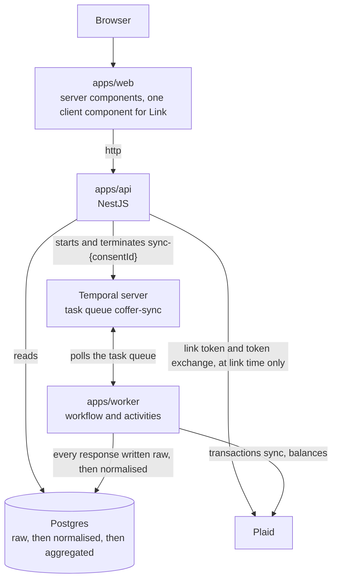
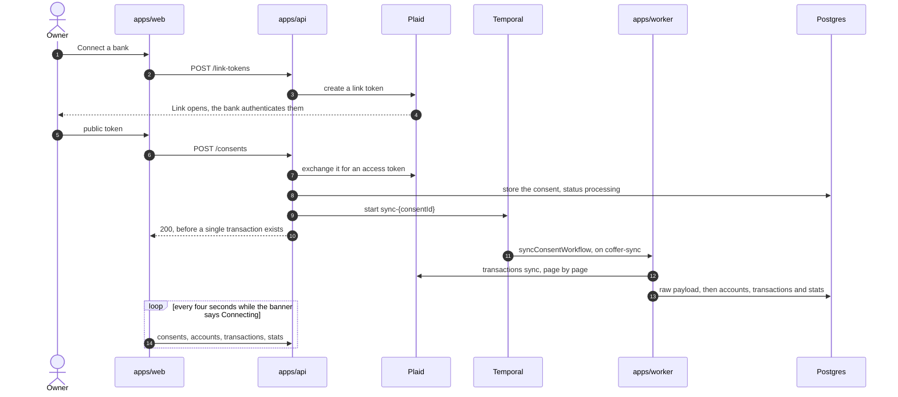
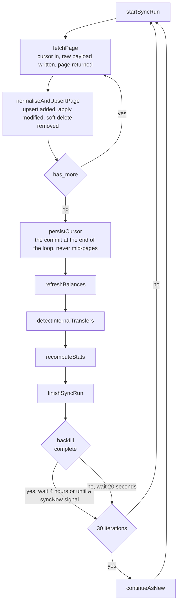

# Coffer

A dashboard showing a customer's linked bank accounts, their balances, their
transactions and the stats derived from them. Behind it sits a Temporal workflow
that syncs against Plaid, writes every provider response to a raw append only
table, and only then normalises and aggregates.

## Running it

```
make install     install every workspace dependency
make up          postgres on 5432, temporal dev server on 7233 with a UI on 8233
make deploy      apply the migrations
make db-build    generate the prisma client and compile the built packages
make seed        create the user and a sandbox business with three months of history
make dev         `make up` and `make db-build`, then web on 3000, api on 3001, worker on the queue
```

`.env` needs `PLAID_CLIENT_ID` and `PLAID_SECRET` from
[the Plaid dashboard](https://dashboard.plaid.com), Team Settings then Keys.
Everything else in `.env.example` has a working default.

Then open [localhost:3000](http://localhost:3000) for the dashboard and
[localhost:8233](http://localhost:8233) for the Temporal UI.

`make sync` signals the running workflow so a sync happens now rather than at
the next four-hourly tick, which is the thing worth watching in the Temporal UI.

To watch a sync pick up something new, seed the other way. The Plaid sandbox
will not give a business-shaped ledger and injectable transactions at the same
time, so there are two modes:

```
make seed          custom sandbox user, business shaped, GBP, fixed transaction set
make seed-dynamic  dynamic sandbox user, US retail data, accepts injections
make sync-new      inject a transaction, then sync, only lands on a dynamic item
```

`make seed` is the default because the default sandbox spending is US retail and
a burn rate computed from it comes out coffee-shop sized.

Seeding twice links a second Plaid item rather than replacing the first, so the
same ledger arrives twice and every transaction appears in the table twice.
`make reseed` clears the consents, terminates their sync workflows and seeds one
clean bank. `make reset` is the clearing half on its own. Neither touches the
seeded user or the migrations.

## The shape of it

Read path and write path are separate processes.



The API reads Postgres and nothing else. The worker is the only process that
polls a bank or holds a long-lived access token. Four things follow: frontend
latency is decoupled from Plaid's, a user hammering refresh cannot burn the
provider quota, access tokens never live in a process serving public traffic,
and a Plaid outage degrades to stale data rather than an error page.

One honest exception. Plaid Link is interactive, so `/link/token/create` and
`/item/public_token/exchange` are synchronous calls made by the API. Two calls,
at link time only, never on a read.

## Linking a bank, end to end

The one flow that crosses every process, from the button to a table with rows in
it.



Step ten is the whole architecture in one line. The link call returns as soon as
the consent is stored and the workflow is started, so nothing in the request
path waits on a bank. Everything after it arrives because the page asks again,
which is why the connecting banner exists rather than a spinner that blocks.

Disconnecting runs the same path backwards. The API terminates the workflow,
tells Plaid to remove the item, then marks the consent revoked, in that order.

## The workflow

One workflow per consent, id `sync-{consentId}`, so a duplicate start is a no-op
rather than a second syncer.



Three details worth pointing at.

**The cursor is persisted after the whole pagination loop, never mid-pages.** A
cursor saved after page two of five, followed by a crash, resumes past
transactions that were never written. Nothing errors and nothing retries, the
balances are simply wrong. It is the most expensive mistake available here.

**A fresh link polls fast until the backfill finishes.** Plaid reports
`transactions_update_status`, and until it says the historical update is
complete the workflow waits twenty seconds rather than four hours. Without that,
a newly linked account shows an empty table for four hours and looks broken.

**Fetching and parsing are separate activities.** The fetch succeeds as soon as
the bytes are safe in `raw_provider_payloads`. A parsing bug then fails a second
activity that retries on its own and never causes a refetch.

Four hourly is six times a day, which roughly matches how often Plaid checks
most institutions itself. Polling harder gains nothing, and the on-demand path
is `/transactions/refresh`, a paid add-on. Inbound rate limiting is
`@nestjs/throttler`, tightest on the link route.

### What Temporal is doing here

The loop above is ordinary code. Temporal is what makes it survivable, and each
piece it contributes earns its place.

**The workflow id is the lock.** `sync-{consentId}`, so starting it twice raises
`WorkflowExecutionAlreadyStartedError`, which the API logs and swallows. Linking
the same bank twice cannot leave two syncers running, and no distributed lock
had to be invented to say so.

**The task queue is the boundary.** The API is only a client of `coffer-sync`,
and the worker is the only process that polls it. That is the mechanism behind
the claim above that access tokens never live in a process serving public
traffic.

**Activities are the only side effects.** All eight boxes in the diagram are
activities, because the workflow function is replayed from its own event history
whenever a worker picks it up, and anything that differs between the run and the
replay corrupts it. So the workflow decides what happens and in what order,
while Plaid, Postgres and the clock are only ever touched by an activity. They
retry five times, five seconds then doubling, two minutes start to close, which
is why each one is written to be safe to run twice.

**Signals are how a sync happens now.** The wait is
`workflow.condition(() => syncRequested, interval)` rather than a sleep, so a
`syncNow` signal cuts it short. `make sync` sends that signal, and a Plaid
webhook would send the same one.

**`continueAsNew` keeps the history bounded.** Every thirty iterations the
workflow starts itself again with a fresh history. A loop that polls for months
without it eventually hits the history limit, having passed every test on the
way there.

**Termination is part of revoking.** `DELETE /consents/:id` terminates the
workflow before it calls Plaid, so a run in flight cannot write against an item
that is about to disappear.

**The rate limit is the queue's job.** `maxActivitiesPerSecond: 5` on the
worker, rather than a hand written token bucket that only holds inside one
process.

Failure has the same shape as success. An activity that exhausts its retries
falls to the catch, `finishSyncRun` records the run as failed with the error,
and the cursor is left exactly where it was. The next iteration starts a fresh
run from that same cursor, so a bad sync costs a delay rather than a gap in the
ledger, and the dashboard reads the failure off the consent and calls itself
stale.

## The raw layer

Every provider response is written to `raw_provider_payloads` before anything is
parsed. Append only, every call, every page, every sync, including responses
where nothing changed. An empty sync still proves you asked and the bank had
nothing.

The pipeline is raw, then normalised, then aggregated, and each stage reads only
the one below it. The read path never queries raw.

Four reasons, and the second is the one that matters in front of an authorised
firm.

- **Replay.** A normalisation bug found three months later is fixable from
  stored bytes without re-hitting the provider, which matters because history
  windows are limited and consent expires. `make replay` does exactly this.
- **Audit.** A disputed figure is answerable with the exact bytes the bank
  returned, not a reconstruction from our own tables.
- **Schema drift.** Providers change fields without telling anyone. A new field
  becomes a query rather than a redeploy.
- **Ingest cannot fail on interpretation.** See the two-activity split above.

## The API

```
POST   /link-tokens            create a Plaid link token
POST   /consents               exchange public_token, store, start workflow, 200
GET    /consents               connection list with status, expiry and lastSyncedAt
DELETE /consents/:id           remove the Plaid item, stop the workflow, revoke
GET    /accounts               accounts with balances, grouped by consent
GET    /transactions           ?accountId&category&from&to&counterparty&offset&limit
GET    /transactions/categories the categories the owner actually has, for the filter
GET    /stats                  balances, monthly in and out, runway, cash zero, deltas
GET    /me                     the signed in owner, for the profile card
```

Transactions is one filtered endpoint rather than nested under an account,
because the table has account, category, date and counterparty filters above a
single combined list. Reads filter `removedAt: null`. No authentication, per the
brief.

Paging is offset and total rather than a cursor, because the table shows
"Showing 26 to 50 of 96" and a Previous link, and a cursor cannot answer either.
The count runs in the same transaction as the page, so the two cannot disagree.

A range that reaches past today, or runs backwards, is a 400 rather than an
empty table. The picker will not offer those dates in the first place, so this
is the guard for a hand written address.

`GET /stats` is a read of `stats_snapshots`, never a computation. The workflow
computes and writes them. The six month series behind the spend and income
charts is the one exception: it is a grouped read over `transactions`, because a
snapshot only ever describes the month it was computed in, and the deltas beside
those figures come from the same series.

`DELETE /consents/:id` terminates the sync workflow before it calls Plaid, so a
run in flight cannot write against an item that is about to disappear. Plaid
refusing the removal does not block the revocation, it is logged and the consent
is revoked anyway.

## Stats

**Total balance** sums `currentBalance` across the cash accounts under an active
consent. Current, not available, to stay on the same accounting basis as a
booked-only ledger. Cash means a `depository` account. A mortgage, a loan or a
credit card carries a positive `current` balance that is money owed rather than
money held, so counting it would inflate the balance and, through it, the
runway. Those accounts still get a card of their own, marked as outside the
total.

**Monthly inflow and outflow** are calendar month, Europe/London, with internal
transfers excluded from both, so the "from last month" comparison has a previous
period to point at.

**Net burn** is outflow minus inflow over the three complete calendar months
before this one, averaged over the months that actually have history. Three
rather than one, because a single month is noise. A month with no transactions
is dropped from the average rather than counted as a zero-burn month, because
counting it halves the burn of a business with two months of linked history and
roughly doubles its runway. Where none of the three has history, the current
month is used.

**Runway** is total balance divided by monthly net burn, rendered as years and
months. **Cash zero** is today plus that. Where burn is zero or negative, both
render as a dash rather than infinity.

The runway curve is a forward projection from the current balance at the current
burn rate. It is not a plot of historical balances and there is no balance
history table. That is a modelling choice, not a shortcut.

## The dashboard

Two pages behind a drawer that collapses to icons, its state kept in a cookie so
the server renders the right width and nothing jumps on load.

**Home** opens on a card per account, each carrying the bank's own logo pulled
from Plaid, then three charts: projected balance falling to cash zero, and six
months of spend and income as bars against the month just gone. Every bar is a
link, so clicking one filters the table to that month and marks the bar as
chosen. Under them sits the paged transaction table, filtered by account, by
category, by a single date range and by counterparty. Every filter applies on
change, there is no Filter button to press.

**Accounts** is where a connection is managed rather than read: what each bank
holds, when the consent was given, when its access expires, and the control to
disconnect it.

## Three dashboard states

Driven off consent `status` and `lastSyncedAt`, and nothing else. In particular
not off how many transactions came back, because a filter that matches nothing
is not a bank that has not answered, and reading it as one put skeleton rows
under a date range that simply had no spending in it.

**Connecting.** A banner naming the bank, balance cards populated, skeleton rows
in the table. The page polls itself every four seconds while this lasts, so
nobody has to guess whether to refresh. This is the state right after linking,
and it is the async architecture made visible. Accounts and balances arrive
almost instantly because banks expose those on demand. Transactions do not,
because Plaid has to pull history from the institution, which takes seconds to
minutes.

**Ready.** Everything rendered.

**Stale.** Last run failed or is more than eight hours old.

An empty table is its own thing rather than a fourth state. It says whether the
filters found nothing or the account has nothing yet, and names the date range
it looked in.

## Layout

```
apps/web            Next.js 16 App Router, Tailwind v4, port 3000
apps/api            NestJS 11, port 3001
apps/worker         Temporal worker, workflow, activities and the seed scripts
packages/database   schema.prisma, migrations, the built Prisma client
packages/contracts  request and response types shared by web, api and worker
packages/provider   Plaid client and normalisation, the only place fetch is allowed
```

## Further reading

| Document                                         | What is in it                                        |
| ------------------------------------------------ | ---------------------------------------------------- |
| [ASSUMPTIONS.md](ASSUMPTIONS.md)                 | Every shortcut taken, and why                        |
| [THREATS.md](THREATS.md)                         | What can go wrong and how this could be exploited    |
| [docs/BUILD-IT-RIGHT.md](docs/BUILD-IT-RIGHT.md) | What production would need that this does not have   |
| [SCHEMA.md](SCHEMA.md)                           | The data model and why it is shaped that way         |
| [docs/ai/](docs/ai/)                             | Every prompt and session behind this build           |
| [CLAUDE.md](CLAUDE.md)                           | Conventions, layering and the lint rules behind them |
