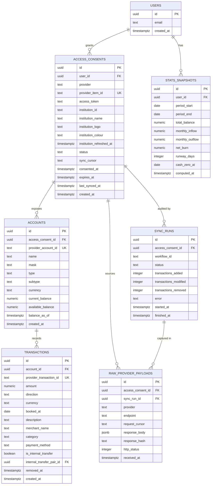

# Round take-home, data model

Scope note. Auth is skipped per the brief, so `users` exists only as an owner
key. One seeded user, hardcoded id.

## Entity relationship diagram



## The one change from your version

You had accounts hanging off users directly. They should hang off the consent.

A user links Monzo and gets back a current account and a savings account. Both
came from one connection, one token, one cursor, one expiry. If accounts point
at the user, you lose which connection produced them, and then you cannot
revoke, reauth or resync a single bank without touching the others. You also
have nowhere natural to put the cursor.

User to account is still available, just transitively through the consent.

## Field notes

**`access_consents.provider_item_id`** is Plaid's Item id. Naming the table
after the Open Banking concept rather than the vendor concept is the right call,
it keeps the door open for Yapily or TrueLayer later.

**`access_consents.sync_cursor`** is the `next_cursor` from `/transactions/sync`.
Persist it only after a full pagination loop completes, never mid-pages. If you
save a partial cursor and then crash, you silently skip transactions.

**`access_consents.status`** wants at least `active`, `reauth_required`,
`revoked`. Disconnecting a bank calls Plaid's `/item/remove`, terminates the
sync workflow and sets `revoked`. Every read filters revoked consents out rather
than deleting rows, so the raw payloads stay auditable.

**`access_consents.institution_logo`** and `institution_colour` are the
optional branding Plaid returns from `/institutions/get_by_id`, cached so the
dashboard never reaches a provider to draw a row.
`institution_refreshed_at` records that the lookup happened, including when it
came back empty, which is what stops a bank without a logo being fetched on
every page load.

**`transactions.direction`** is a normalised `in` or `out`. Plaid returns
positive amounts for money leaving the account, which is the opposite of what
most people assume. Normalise once on write, at the persistence boundary, and
keep `amount` unsigned. Every stats bug you would otherwise have disappears.

**`transactions.provider_transaction_id`** unique, and upsert on it. Sync
returns added, modified and removed, so the write path is an upsert plus a soft
delete, not an insert.

**`transactions.removed_at`** rather than a hard delete. Removed transactions
still need to leave the stats, and a soft delete makes the sync idempotent.

**`transactions.is_internal_transfer`** plus the self-referencing pair id.
Detection is a heuristic. Same absolute amount, opposite direction, within three
days, across two accounts belonging to the same user. Flag both rows, still show
them in the transactions table, exclude them from inflow, outflow and runway.

**`stats_snapshots`** exists so the stats endpoint is a read and not a
computation. The Temporal workflow writes it after each sync. It also gives you
the previous period for free, which is what the "+10% from last month" figure in
the mockup needs.

**`sync_runs`** is optional. It costs one table and it makes the video better,
because you can show a row appearing per workflow execution next to the Temporal
UI showing the same run.

## The raw layer

Every provider response is written to `raw_provider_payloads` before anything is
parsed. Append only, never updated, never deleted by application code. The
pipeline is raw, then normalised, then aggregated, and each stage only ever
reads the one below it.

Four reasons, and the second one is the one to lead with in front of an FCA
authorised firm.

**Replay.** If the normalisation has a bug, a sign inversion or a bad category
mapping, the derived tables can be rebuilt from raw without touching the
provider again. This matters more than it sounds, because provider history
windows are limited and consent expires. Without a raw layer, a parsing bug
found three months later means data you can never recover.

**Audit.** When a customer disputes a figure, the answer has to be the exact
bytes the bank returned at that moment, not a reconstruction from your own
tables. Regulated finance needs the provenance, not just the number.

**Schema drift.** Providers add and change fields without telling you. Storing
raw means a new field is a query away rather than a redeploy away.

**Ingest cannot fail on interpretation.** The fetch activity writes raw and
succeeds. A parsing error fails the normalise activity, which retries
independently, and the fetch is never repeated.

Caveats to state rather than solve. Raw payloads are full of PII, so retention
and encryption at rest are real production concerns. The table grows fast and
would want monthly partitioning. And the read path must never query it.

## Access boundary

Read path is the REST API and it touches Postgres only. Write path is the
Temporal worker and it is the only process holding provider credentials or
making outbound calls to Plaid.

The one exception is linking. Plaid Link is interactive, so
`/link/token/create` and `/item/public_token/exchange` are synchronous calls
from the API. Two calls, at link time only, never on a read.

Outbound rate limiting to the provider is a Temporal worker setting rather than
a hand written token bucket. Inbound rate limiting on the API is separate and
sits tightest on the link route.

## Indexes worth having

```
transactions (account_id, booked_at desc)     -- the recent transactions table
transactions (provider_transaction_id) unique  -- dedupe on upsert
transactions (account_id, amount, booked_at)   -- internal transfer matching
accounts (access_consent_id)
access_consents (user_id)
raw_provider_payloads (access_consent_id, received_at desc)
raw_provider_payloads (response_hash)          -- skip identical repeat payloads
```

## What is deliberately not here

- No `institutions` table. Denormalised onto the consent, one less join.
- No balance history table. The runway curve in the mockup is a forward
  projection from the current balance at the current burn rate, not a plot of
  past balances. Say this out loud in the walkthrough, it is a real modelling
  choice and not a shortcut.
- No categories table. Plaid's category string, stored flat.
- No audit or soft delete anywhere except transactions.
