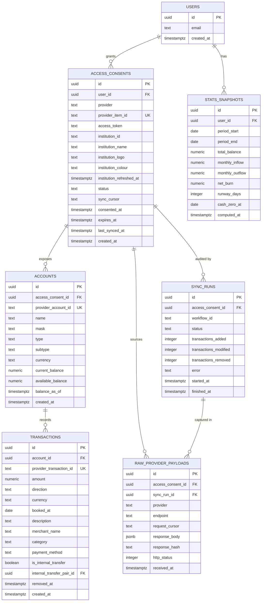

# Coffer, the data model

Authentication is skipped per the brief, so `users` exists only as an owner key.
One seeded user, hardcoded id.

## Entity relationship diagram



## Why accounts hang off the consent

The obvious shape is accounts belonging to a user. This one puts them under the
consent instead, and that is the only structural decision here worth arguing
about.

Linking Monzo returns a current account and a savings account. Both came from
one connection, and they share one access token, one sync cursor and one expiry
date. Point them at the user and there is no longer a row that represents the
connection, so a single bank cannot be resynced, reauthorised or revoked without
touching every other bank the customer has linked. The cursor also has nowhere
natural to live, and a cursor stored per account would be wrong, because
`/transactions/sync` is per item and not per account.

User to account is still reachable, one join further out through the consent.

## Field notes

**`access_consents.provider_item_id`** is Plaid's Item id. The table is named
after the Open Banking concept rather than the vendor one, which is what keeps
the door open for Yapily or TrueLayer without a migration.

**`access_consents.sync_cursor`** is the `next_cursor` from
`/transactions/sync`. It is written only after a full pagination loop completes,
never between pages. A cursor saved after page two of five, followed by a crash,
resumes past transactions that were never stored, and nothing errors or retries.
The balances are simply wrong from then on.

**`access_consents.status`** is `processing`, `active`, `reauth_required` or
`revoked`. A new consent starts at `processing` and the dashboard renders its
connecting state from it. Disconnecting a bank calls Plaid's `/item/remove`,
terminates the sync workflow and sets `revoked`. Every read filters revoked
consents out rather than deleting rows, so the raw payloads stay auditable.

**`access_consents.institution_logo`** and `institution_colour` hold the
optional branding Plaid returns from `/institutions/get_by_id`, cached so the
dashboard never reaches a provider to draw a row.
`institution_refreshed_at` records that the lookup happened, including when it
came back empty, which is what stops a bank without a logo being fetched on
every page load.

**`transactions.direction`** is a normalised `in` or `out`, and `amount` is
unsigned. Plaid returns positive amounts for money leaving the account, the
opposite of what most people assume. Normalising once at the persistence
boundary means no code above it can get the sign wrong.

**`transactions.provider_transaction_id`** is unique and the write path upserts
on it. Sync returns added, modified and removed, so a write is an upsert plus a
soft delete rather than an insert.

**`transactions.removed_at`** rather than a hard delete. Removed transactions
still have to leave the stats, and a soft delete is what makes the sync
idempotent.

**`transactions.is_internal_transfer`** and the self-referencing
`internal_transfer_pair_id`. Detection is a heuristic: same absolute amount,
opposite direction, within three days, across two accounts under one user. Both
rows are flagged and paired. They stay visible in the transactions table and are
excluded from inflow, outflow, net burn and runway. False positives on
coincidental equal amounts are possible, and the consequence of that heuristic
is covered in THREATS.md.

**`stats_snapshots`** is what makes `GET /stats` a read rather than a
computation. The workflow writes a snapshot after each sync, which also leaves
the previous period available for the month-on-month comparison.

**`sync_runs`** records one row per workflow execution with counts and any
error, so a sync that failed silently against the provider is still visible in
the database rather than only in the Temporal history.

## The raw layer

Every provider response is written to `raw_provider_payloads` before anything is
parsed. Append only, never updated, never deleted by application code. The
pipeline is raw, then normalised, then aggregated, and each stage reads only the
one below it. The read path never touches raw.

Four reasons, and the second is the one that matters most for a regulated firm.

**Replay.** A normalisation bug, a sign inversion or a bad category mapping is
fixable from stored bytes without re-hitting the provider. That matters because
provider history windows are limited and consent expires, so without a raw layer
a parsing bug found three months later means data that can never be recovered.

**Audit.** A disputed figure has to be answerable with the exact bytes the bank
returned at that moment, not a reconstruction from derived tables.

**Schema drift.** Providers add and change fields without notice. A new field
becomes a query rather than a redeploy.

**Ingest cannot fail on interpretation.** Fetching and parsing are separate
activities. The fetch succeeds once the bytes are stored, and a parsing error
fails the normalise activity, which retries on its own and never causes a
refetch.

Raw payloads are full of PII, so retention and encryption at rest are real
production concerns, and the table wants monthly partitioning at any volume.
Both are covered in THREATS.md.

## Access boundary

The read path is the REST API and it touches Postgres only. The write path is
the Temporal worker, and it is the only process holding provider credentials or
making outbound calls to Plaid.

Linking is the one exception. Plaid Link is interactive, so
`/link/token/create` and `/item/public_token/exchange` are synchronous calls
from the API. Two calls, at link time only, never on a read.

Outbound rate limiting to the provider is a Temporal worker setting rather than
a hand written token bucket. Inbound rate limiting on the API is separate and
sits tightest on the link route.

## Indexes

```
transactions (account_id, booked_at desc)      the transaction table read
transactions (provider_transaction_id) unique  dedupe on upsert
transactions (account_id, amount, booked_at)   internal transfer matching
accounts (access_consent_id)
access_consents (user_id)
raw_provider_payloads (access_consent_id, received_at desc)
raw_provider_payloads (response_hash)          skip identical repeat payloads
```

## What is deliberately not here

**No `institutions` table.** Branding is denormalised onto the consent, which
costs one join less and cannot go stale in a way anyone would notice.

**No balance history table.** The runway curve is a forward projection from the
current balance at the current burn rate rather than a plot of past balances.
That is a modelling choice, not a shortcut, and a real one would need daily
balance snapshots.

**No categories table.** Plaid's category string, stored flat.

**No soft delete anywhere except transactions.** Consents are revoked rather
than removed, and everything else is append only or genuinely mutable.